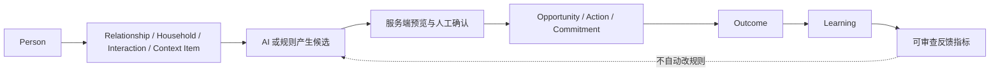

# 目标 CRM：分层设计与迁移路线

状态：规划中；对应 [requirements.md](requirements.md)。本设计只定义实施边界；各工作包开始前必须重新核对线上事实与影响。

## 一条主链路

主界面承载“人、今日、机会、活动、招募、AI 助手”；旧完整编辑能力保留在“更多”和原 URL，直到对应功能逐项验收。`admin.html` 继续承载旧业务；新的 AI-native 入口只在 `crm/js/modules/` 实现，复用已有 core/components/css。前端通过现有 `callFn`；权限与写入边界落在服务端。

## 服务与数据职责

| 层 | 主责 | 不负责 |
| --- | --- | --- |
| PersonService | 身份解析、显式关联与防误合并 | 按姓名自动猜人 |
| InteractionService / Legacy Adapter | 统一时间线、来源去重、有限字段查询 | 全量历史复制、把报名冒充到场 |
| Context Engine | 按 recipe 读取最近且必要的字段，附来源并记录快照 | 把全库长记录送给模型 |
| AI Gateway + Skill Registry | 按 capability 调 CloudBase 托管模型，结构化验证、超时/重试/审计 | 在业务代码中固定模型厂商或自动确认事实 |
| Candidate / Command 服务 | 服务端核实证据、预览、确认令牌、幂等执行 | 信任客户端 `confirmed` 或自然语言即执行 |
| Action / Opportunity / Outcome 服务 | 单一事实源及状态迁移 | 旧来源的无条件二次复制 |
| Legacy Compatibility | 保留旧 customer/recruit/activity/insurance URL 与字段语义 | 作为新功能的长期第二事实源 |

数据沿用已经存在的 `public` 底座表，不因空表再建同义表。新字段或数据库函数确有必要时，只在独立工作包提供 migration、rollback、权限矩阵和依赖视图核对；不触碰 `pr` 或 `pr_*`。生产业务写入前，需在函数内核对真实登录身份；敏感表仅通过最小范围的服务端授权访问。服务端权限测试需要同时检查拒绝路径。

## CloudBase AI 的当前取舍

CloudBase 文档支持托管模型通过资源点套餐计费；模型接口仍会带具体模型标识。因此模型标识只在 CloudBase/AI Gateway 配置解析处出现，业务 Skill 仅声明 `capability`。上线前检查目标环境的文本、视觉能力是否可用及套餐资源点状态；视觉不可用时明确显示“暂不可用”，不静默切到第三方，也不在本阶段开发模型管理页面。AI 输出都带任务、运行、结果和用户反馈审计；事实/截止日期从 `public` 读取。参考：[CloudBase AI 介绍](https://docs.cloudbase.net/ai/introduce)、[Node SDK 模型调用](https://docs.cloudbase.net/ai/model/nodejs-access)。

## 测试样本：少量、可追踪、走真实链路

样本留在当前 CRM 的 `public`，不使用另一环境。种子器先 dry-run，列出每张表将新增的业务行、因触发器同步产生的关联行及总数；**初始落库总数最多 10 条业务记录**，在事务中以稳定键幂等写入。之后用户按真实流程确认产生的业务行和 AI task/run/result 审计行不计入初始上限，但必须单独计数、关联批次并防止重复提交。以后工作包不得借“扩充场景”隐蔽增加第 11 条初始样本；若已占满，可复用或更新样本，经正常业务流程生成后续记录，仍不够则报告限制。

可见文本统一带 `【系统测试·勿联系】`，同时保存机器可识别的批次标识，例如 `crm_test_20261002_a`。`actions.source`、`commitments.source` 只接受小写字母/数字/下划线，因此原规划的大写 `CRM_DEMO_V1` 不能直接用于这些字段；`source_type` 等枚举字段也不能任意填批次。每表先核验真实约束：能放入既有 `source` / `metadata` 的才放，其他记录用受保护的“表名 + 主键 + 关联批次”清单追踪；不能只靠全文搜索姓名、备注或标题。清单记录初始种子、流程衍生记录及 AI 审计 ID，不含真实个人信息，后续可做精确清理 dry-run。是否增加最小标记字段由独立工作包核验，若需要则提供 migration/rollback。

优先预填 1–2 位虚构 Person 和少量现实感较强的互动、待办或机会；其他领域通过同一组 Person 的正常确认流程逐步产生资料。真实联系方式、保单号、身份证件、可外发任务和照片均不使用。家庭成员 Person/关联不得因原始文字而自动创建，必须人工确认。用户只需打开预填场景并点击必要的身份或业务确认，无需手工录入文本。

测试样本**参与**真实 Today 排名、漏斗、经营统计、AI Search/Context 和主动提醒。相关页面、结果和 AI 上下文应标明“含测试数据”及可核对的样本来源/数量，避免把虚构结果当作真实经营结论；不改变事实筛选规则来照顾样本。现有漏斗在某漏斗总样本不足 10 时会隐藏转化率，这种情况下只验证计数和流程。样本可以暂留；任何未来清理只能按批次 ID 清单预览影响并取得针对删除的授权，不自动删除线上数据。

## 收敛旧功能的方法

“入口不重复”与“移除旧实现”分开实施。先让主入口只展示新流程和一个明确的完整旧版链接；不会把同一 Action 同时当作统一 Action 与旧跟进各排一次。为每个领域建立功能矩阵：字段、创建/编辑/删除/恢复、权限、移动端、导出、异常路径、使用量、数据迁移和回滚。替代率达到 100% 且真实账号回归稳定后，旧入口仍保留在“更多”观察 90–180 天或用户批准的观察期。只有没有隐含依赖、已备份、可回滚，并得到逐项删除批准，才可删或改名；否则旧入口继续可用。旧数据不因导航移动而丢失。

## 分段验收门槛

| Gate | 达成条件 |
| --- | --- |
| G0 基线/样本 | 源码与线上权限基线一致；标记、批次 ID 清单、10 条初始上限和“含测试数据”提示可验证；幂等种子器能 dry-run/重跑。 |
| G1 核心闭环 | Person → Quick Capture → Interaction/Context → Opportunity/Action/Commitment → Today → Outcome 在真实取数的预填场景走通；关键写入逐项人工确认，旧入口回归通过。 |
| G2 领域闭环 | 活动、招募、保险、知识/话术可从 Person 360 到达完整操作；证据充分/不足两类路径可复现；旧页面数据与权限不回退。 |
| G3 AI/反馈闭环 | AI Gateway 真实调用、结构化结果、来源、用户四类反馈及 Outcome/Learning 可追踪；自然语言动作未经确认均拒绝。 |
| G4 可靠与收敛 | 目标数据量的性能基线、事务/幂等、安全矩阵、运行时与超时均有独立回归记录；新主导航不重复，旧入口按证据逐项保留或另案批准退出。 |

每个 Gate 都要有成功与失败路径证据，不能以空表、模拟函数返回或源码哈希代替真实业务验证。每个工作包单独提交、部署、打标签、核对三端；发布失败则保持未完成状态。
